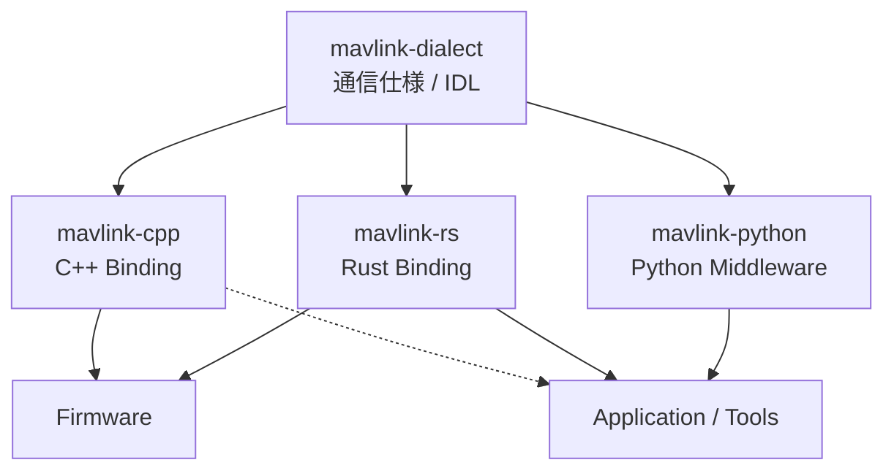
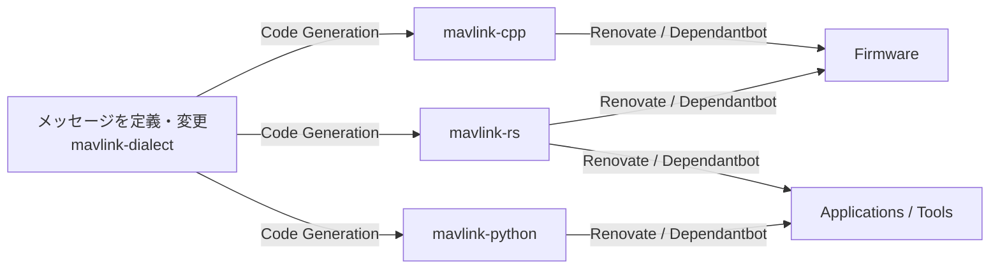

# MAVLink Dialect

本リポジトリは、システム内で使用する **MAVLink通信仕様（Dialect）を一元管理するリポジトリ**です。

MAVLinkを通信プロトコルとして利用し、デバイスやアプリケーション間で交換するデータの構造・意味を共通化します。

ここで定義した通信仕様を基準として、C++、Rust、Pythonなど各言語向けのライブラリを生成・提供し、ファームウェアやPCアプリケーションから同じ通信仕様を利用できるようにします。

## プロジェクト全体像

本プロジェクトでは、**通信仕様と、その仕様を利用するソフトウェアを分離**して管理します。

`mavlink-dialect` は、**「何をどのような形式で通信するか」** を定義します。

`mavlink-cpp`、`mavlink-rs` は、それぞれC++、RustからMAVLink通信仕様を利用するためのBindingです。組み込みファームウェアだけでなく、PC上で動作するアプリケーションからも利用できます。

`mavlink-python` は、PythonからMAVLinkを利用するためのMiddlewareです。通信機能に加えて、Publisher / Subscriber、Recorder、Replayなど、アプリケーション開発に必要な機能を提供します。

このように通信仕様を実装から分離することで、使用する言語や実行環境が異なっても、同じ通信仕様を共有できます。

## 各リポジトリの役割

| リポジトリ                 | 役割                         |
| -------------------- | -------------------------- |
|[mavlink-dialect](https://github.com/TeamMeltingPoppo/mavlink-dialect)| MAVLink通信仕様 / IDLの定義       |
| [mavlink-cpp](https://github.com/TeamMeltingPoppo/mavlink-cpp)| C++向けMAVLink Binding       |
|[mavlink-rs](https://github.com/TeamMeltingPoppo/mavlink.rs)| Rust向けMAVLink Binding      |
|[mavlink-python](https://github.com/TeamMeltingPoppo/mavlink-python)| Python向けMAVLink Middleware |
|[template-platformio](https://github.com/TeamMeltingPoppo/template-platformio)| ファームウェア開発環境の共通テンプレート       |

各リポジトリは連携して使用しますが、それぞれ異なる責務を持ちます。

特に、**通信仕様の定義は `mavlink-dialect` に集約し、各言語側で通信仕様を個別に定義しない**ことを基本とします。

## 通信仕様の変更

MAVLinkのメッセージを追加・変更する場合は、まず `mavlink-dialect` の定義を変更します。

通信仕様を変更した際には、生成されたライブラリとの対応関係や互換性を確認し、各リポジトリで利用するバージョンを管理します。

詳細な設計方針については [Architecture](docs/architecture.md) を参照してください。