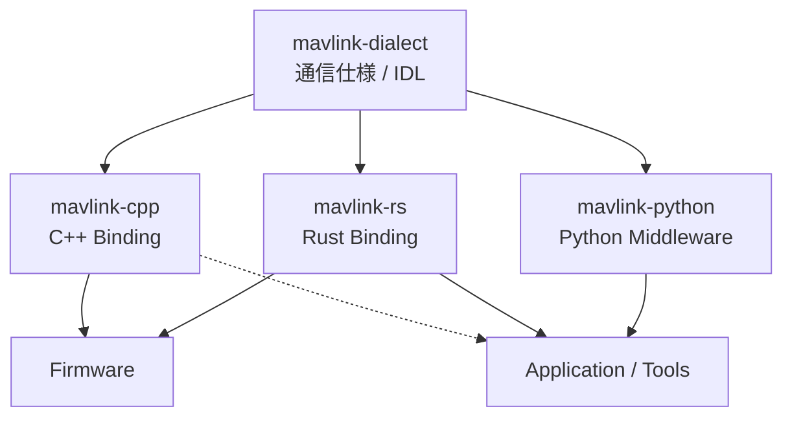
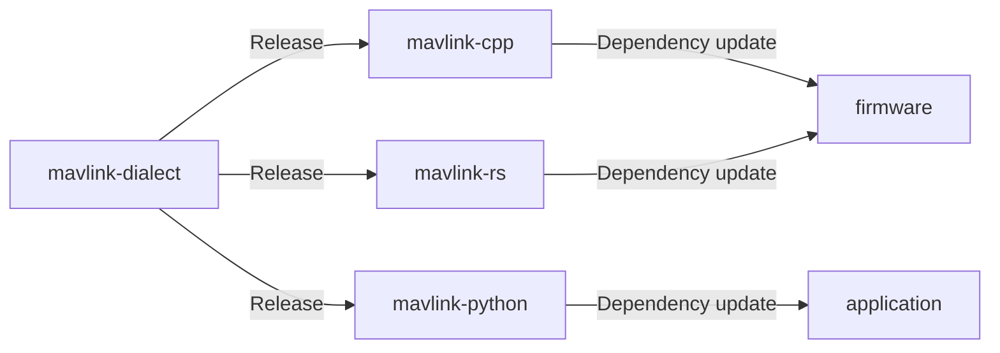

# Swingbyの通信システムの構成

## 全体像

本プロジェクトでは、**通信仕様と、その仕様を利用するソフトウェアを分離**して管理します。

`mavlink-dialect` は、**「何をどのような形式で通信するか」** を定義します。

`mavlink-cpp`、`mavlink-rs` は、それぞれC++、RustからMAVLink通信仕様を利用するためのBindingです。組み込みファームウェアだけでなく、PC上で動作するアプリケーションからも利用できます。

`mavlink-python` は、PythonからMAVLinkを利用するためのMiddlewareです。通信機能に加えて、Publisher / Subscriber、Recorder、Replayなど、アプリケーション開発に必要な機能を提供します。

このように通信仕様を実装から分離することで、使用する言語や実行環境が異なっても、同じ通信仕様を共有できます。

## 通信仕様の全体像

通信仕様の定義は、その責務に応じて複数のファイルに分割して管理します。

| Dialect | 責務 |
|---|---|
| `system.xml` | Systemの発見・識別・同期・設定など、Systemを成立・管理する基本機能 |
| `command.xml` | Command Protocol |
| `diagnostics.xml` | Health、Battery、Calibration等の診断・保守情報 |
| `sensor.xml` | センサーから直接得られる観測値 |
| `model.xml` | 推定・融合・演算された物理量 |
| `transport.xml` | Transport層で必要な通信制御 |
| `debug.xml` | 開発・試験専用のメッセージ |

単なる機能別のファイル分割ではなく、MAVLinkメッセージの責務を明確にするための境界として扱います。

## メッセージ定義の更新

MAVLinkの定義を単一のリポジトリで管理し、その変更を依存する実装・テンプレートへ自動的に伝播させるようにしています。これにより、通信仕様やメッセージ定義などの食い違いが起こらないようにしています。

## Where to Start

用途に応じて以下のリポジトリから参照してください。

- MAVLink のメッセージや enum の定義を確認したい
  → [mavlink-dialect](https://github.com/TeamMeltingPoppo/mavlink-dialect)

- C/C++ で MAVLink を利用したい
  → [mavlink-cpp](https://github.com/TeamMeltingPoppo/mavlink-cpp)

- Python から MAVLink を利用したい
  → [mavlink-python](https://github.com/TeamMeltingPoppo/mavlink-python)

- Rust から MAVLink を利用したい
  → [mavlink-rs](https://github.com/TeamMeltingPoppo/mavlink-rs)

- PlatformIO でファームウェア開発を始めたい
  → [template-platformio](https://github.com/TeamMeltingPoppo/template-platformio)

- Embassy + Rust でファームウェア開発を始めたい
  → [template-embassy](https://github.com/TeamMeltingPoppo/template-embassy)