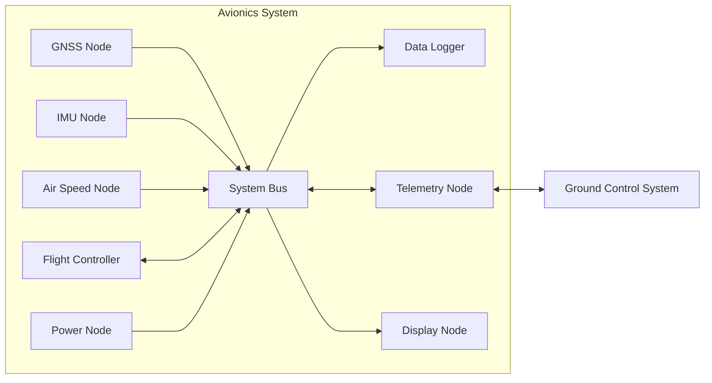
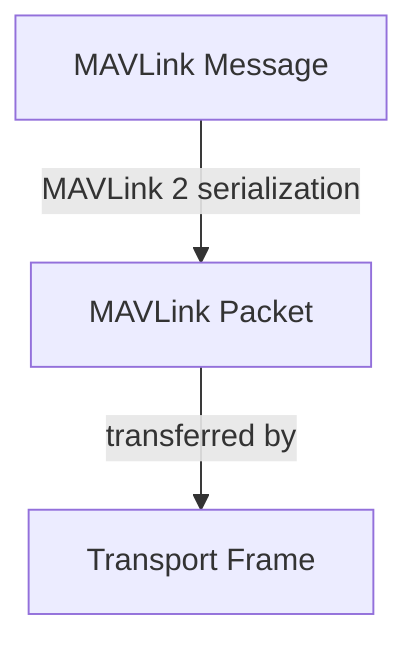
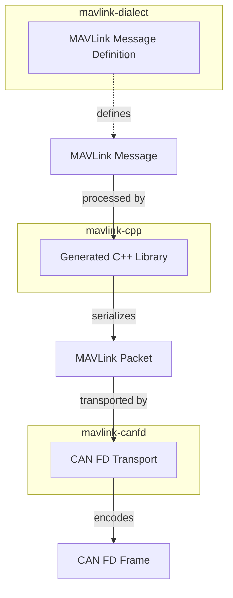

# Swingbyの通信システムの構成

## 用語の定義

本章では、本仕様で使用する主要な用語について説明します。

**MAVLink** は、システム間で構造化されたデータを交換するための軽量なメッセージングプロトコルです。本システムでは、電装システム間および電装システムと地上システムとの間でデータを交換するためにMAVLinkを使用します。

**MAVLink dialect** は、MAVLinkで交換するメッセージ、列挙型、コマンドなどのデータ定義をまとめたものです。本repositoryでは、本システムで使用するMAVLink dialectを定義します。

**MAVLink message** は、MAVLink dialectによって定義される論理的なデータ単位です。MAVLink messageは、複数のfieldから構成され、各fieldはデータ型、意味および単位を持ちます。

**Field** は、MAVLink messageを構成する個々のデータ要素です。Fieldには、名前、データ型および意味が定義されます。必要に応じて、単位、スケールなども定義されます。

**Wire format** は、通信媒体上でデータを交換するために使用するバイト列の構造および符号化規則です。Wire formatは、論理的なデータの表現方法と、通信上で実際に扱われるバイト列との対応を規定します。本システムでは、MAVLink 2がMAVLink messageをMAVLink packetとして表現するwire formatを規定します。

**MAVLink packet** は、MAVLinkのwire formatに従ってMAVLink messageを符号化したバイト列です。MAVLink packetには、messageの識別情報、payloadおよび整合性を確認するための情報などが含まれます。

**Transport** は、MAVLink packetをある通信ノードから別の通信ノードへ転送するための仕組みです。本システムでは、CAN FDなどの通信方式をMAVLink packetのtransportとして使用します。

**Transport frame** は、transportが通信媒体上で転送するデータ単位です。例えばCAN FDをtransportとして使用する場合、CAN FD frameがtransport frameに相当します。MAVLink packetとtransport frameは異なる概念であり、1つのMAVLink packetを複数のtransport frameに分割して転送する場合があります。

**Node** は、MAVLink messageを送信または受信するシステム上の通信主体です。Nodeには、例えばGNSS基板、IMU基板、フライトコンピュータ、データロガーおよびGround Control Systemが含まれます。

## Scope & Responsibilities

本repositoryは、電装システムで使用するMAVLink dialectを定義します。

MAVLink messageに関する仕様は、本repositoryの定義を正とし、各firmwareやその他の実装が個別にmessageの構造や意味を定義してはならないことにします。

本repositoryは、MAVLink messageについて以下を扱う範囲とします。

- MAVLink messageの定義
- Message IDの定義
- Fieldの名前およびデータ型の定義
- Fieldの意味、単位およびスケールの定義
- 列挙型およびその他のMAVLink dialect要素の定義
- MAVLink dialectの妥当性を検証するための規則

一方、本repositoryは以下を扱いません。

- Firmwareの実装
- Hardwareの設計および実装
- MAVLink packetの符号化および復号を行うライブラリの実装
- Transportの実装
- CAN FD frameの構造およびCAN FD上での転送方式
- CAN FDの物理層および通信速度などのhardware-specificな設定
- Ground Control Systemの実装
- Data loggerの実装

MAVLink packetの符号化および復号は、MAVLink dialectを入力として生成される共有ライブラリが担当する。Transportは、MAVLink packetを通信媒体上で転送する役割を担当します。FirmwareおよびGround Control Systemは、MAVLink messageを利用して、それぞれの機能を実装します。

本repositoryは、MAVLinkのwire formatそのものを変更または再定義しません。MAVLinkが規定するwire formatに従い、本システムで使用するMAVLink dialectを定義します。

本repositoryの変更によって生成される共有ライブラリおよび各Firmwareの実装は、本repositoryで定義されたMAVLink dialectに依存します。したがって、MAVLink dialectの変更と、その変更を利用する実装の更新は、CIおよびリリースプロセスによって管理します。

## System Overview

Swingbyの電装の通信システムは、複数のNodeがSystem Busを介して接続された構成になっています。各Nodeは、GNSS、慣性計測、対気速度計測、機体制御、電源管理、データ記録、テレメトリまたは表示など、それぞれ異なる役割を持っています。

さらに、各Nodeは、MAVLinkを使用してSystem Bus上でデータを交換します。System Busは、CAN FDなどの通信方式を使用して、各Node間でMAVLink packetを転送します。

System Busには、データを生成するNodeだけでなく、Data LoggerやDisplay Nodeのように他のNodeが送信したMAVLink messageを受信するNodeも接続されています。また、Telemetry NodeはSystem BusとGround Control Systemの間でMAVLink messageを中継し、機体側のNodeとGround Control Systemとの間の通信を提供します。

以下に、Swingbyの電装の通信システムのNode間の接続関係を示します。

図中の矢印は、メッセージの送信方向を示します。双方向の矢印は、メッセージが双方向に送信されることを示します。

## Protocol Architecture

本システムでは、Node間で交換するデータの定義と、そのデータを通信媒体上で転送するための処理を分離して扱います。本章では、本システムで使用するProtocol Stack、その各要素に対するrepositoryの責務、およびNode間でデータを送受信する際のData Flowを示します。

### Protocol Stack

本システムでは、Node間で交換するデータをMAVLink messageとして定義し、MAVLink 2のwire formatに従ってMAVLink packetとして符号化する。MAVLink packetはTransportによって通信媒体上で転送される。

本システムにおけるProtocol Stackを以下に示す。

このProtocol Stackでは、MAVLink messageの定義と、MAVLink packetを通信媒体上で転送するためのTransportを分離します。したがって、MAVLink messageの仕様は特定の通信媒体に依存せず、TransportはMAVLink messageの意味に依存しません。

### Repository Responsibilities

Protocol Stackの各要素は、複数のrepositoryに分割して管理します。この節では、各repositoryが何を担当しているかを説明します。

#### `mavlink-dialect`

本システムで交換するMAVLink messageを定義するrepositoryである。Messageの構造、fieldの意味およびその他のdialect要素について、本repositoryの定義を正とする。

#### `mavlink-cpp`

`mavlink-dialect`を入力として生成されるC++ライブラリを提供するrepositoryである。各firmwareはこのライブラリを利用して、MAVLink messageの生成および解析と、MAVLink 2のwire formatに従ったMAVLink packetのserializationおよびdeserializationを行う。

#### `mavlink-canfd`

MAVLink packetをCAN FD上で転送するためのTransportを提供するrepositoryである。CAN FD frameへの分割およびMAVLink packetへの再構成など、CAN FD固有の転送処理を担当する。一方で、個々のMAVLink messageの構造や意味は解釈しない。

#### 各repositoryの責務

各repositoryの責務を以下に示します。

各firmwareは、原則として`mavlink-cpp`を利用してMAVLink messageを扱い、Transportの実装には`mavlink-canfd`を利用します。これにより、firmwareごとにMAVLink packetのserializationやCAN FD Transportを個別に実装する必要がありません。

### Data Flow

この節では、送受信を行う際に具体的にどのような処理が行われるかを説明します。

#### 送信処理

MAVLink messageを送信する場合、送信側のApplicationは`mavlink-cpp`が提供する機能を利用してMAVLink messageを生成します。MAVLink messageはMAVLink 2のwire formatに従ってMAVLink packetへ符号化され、その後、`mavlink-canfd`によってCAN FD上で転送されます。

送信側における処理の流れを以下に示します。

#### 受信処理

受信側では、CAN FD frameからMAVLink packetを復元し、MAVLink 2のwire formatに従ってMAVLink messageへ復号します。復号されたMAVLink messageは、受信側のApplicationによって利用されます。

受信側における処理の流れを以下に示します。

送信側と受信側では処理の方向が逆になります。送信側ではMAVLink messageをMAVLink packetへ符号化した後、CAN FD frameとして転送します。受信側ではCAN FD frameからMAVLink packetを復元した後、MAVLink messageへ復号します。

この処理において、MAVLink messageの仕様は`mavlink-dialect`、MAVLink packetのserializationおよびdeserializationは`mavlink-cpp`、CAN FD上での転送処理は`mavlink-canfd`がそれぞれ担当します。

## Message Architecture

本システムでは、Node間で交換する情報をMAVLink messageとして定義します。MAVLink messageは、単一の情報を表現するためにできるだけ小さな単位に分割して設計します。MAVLink messageの具体的な構造は`mavlink-dialect`で定義します。本章では、messageを設計および運用する際の共通規則を定めます。

### Messageの有効性

MAVLink messageの各fieldには、値が有効である条件を必要に応じて定義します。

MeasurementやStateなどのmessageでは、センサやNodeの状態によって値を取得できない場合がある。この場合、Subscriberが値の有効性を判定できるように、messageまたはfieldについて有効性を表現する方法を定義する。

Messageの有効性と通信の成否は別の概念として扱う。MAVLink messageを正常に受信できた場合でも、そのmessageに含まれる計測値が有効であるとは限りません。

例えば、GNSS Nodeから測位情報を正常に受信した場合でも、GNSSが測位状態を確立していなければ、測位結果を有効な情報として利用できない場合があります。このような状態は、通信の成否とは別にmessageまたはfieldの状態として表現します。

### Messageの決め方の原則

MAVLink messageは、以下の原則に従って設計します。

1. 1つのmessageは明確に定義された一つの目的を持つものとする。異なる目的の情報を一つのmessageにまとめることで、messageの意味や利用条件が曖昧にならないようにする。

1. fieldの意味および単位を明確に定義する。物理量を表すfieldについては、原則としてSI単位系を使用する。単位だけでなく、必要に応じてスケール、符号、基準座標系および有効範囲を定義する。

1. messageの受信側がmessage単体から必要な情報を解釈できるようにする。外部文書や特定のfirmware実装を前提としなければ意味を解釈できないmessage設計は避ける。

1. messageの変更による互換性への影響を考慮する。既存messageのfieldを変更または削除する場合は、既存のPublisherおよびSubscriberへの影響を評価する。互換性に関する具体的な規則は、Compatibility and Versioningで定義する。

## External Interfaces

本repositoryで定義するMAVLink dialectは、複数のfirmwareおよび外部システムから利用される共通の通信仕様です。本章では、MAVLink dialectと各外部システムとのインターフェースを定義します。

各外部システムは、本repositoryで定義されたMAVLink messageを利用してNode間の通信を行います。外部システムはMAVLink messageの定義を独自に変更してはならず、messageの構造および意味については本repositoryの定義を正とします。

### Firmware

Firmwareは、Node上で動作するソフトウェアであり、MAVLink messageを生成および利用します。

Firmwareは、`mavlink-cpp`が提供する共有ライブラリを利用してMAVLink messageを扱います。FirmwareはMAVLink 2のwire formatやMAVLink packetのserializationおよびdeserializationを直接実装せず、原則として共有ライブラリが提供する機能を利用します。

Firmwareは、Nodeの機能に応じて必要なMAVLink messageを利用する。各Firmwareが利用するmessageとその役割は、対応するmessage仕様に従います。

Firmware固有の処理、タスク構成、ハードウェア制御およびTransport Driverの実装は、本repositoryの責任範囲ではありません。

### Data Logger

Data Loggerは、System Bus上で交換されるMAVLink messageを受信し、後から解析可能な形式で記録するNodeです。

Data Loggerは、記録対象となるMAVLink messageを受信し、その内容および受信時刻などの必要な情報を記録します。記録形式および記録媒体はData Logger側で定義します。

Data Loggerは、MAVLink messageの定義を変更せず、本repositoryで定義されたmessageをそのまま記録および解析できることを基本とします。

Data LoggerがMAVLink packetそのものを保存する場合、そのpacketはMAVLink 2のwire formatに従ったデータとして扱います。MAVLink messageへ復号したデータを保存する場合は、元のmessageとの対応を追跡できるようにします。

### Ground Control System

Ground Control System (GCS)は、機体および電装システムの状態を監視し、必要に応じてNodeへcommandを送信する外部システムです。

GCSは、本repositoryで定義されたMAVLink dialectを利用して、機体側のNodeとMAVLink messageを交換します。GCSは、firmwareと同じmessage定義を使用し、独自のmessage定義を持ちません。

GCSとAvionics Systemとの間の通信はTelemetry Nodeを介して行います。Telemetry Nodeは、機体側のTransportとGCS側の通信方式との間を接続します。

GCSのUser Interface、内部データモデル、通信処理および表示方法は、本repositoryの責任範囲ではありません。

### Generated Libraries

本repositoryのMAVLink dialectから、各言語および環境で利用するためのMAVLinkライブラリを生成します。

生成されたライブラリは、MAVLink messageの定義とMAVLink 2のwire formatを各実装で一貫して利用するために使用します。生成物は、MAVLink dialectの特定のversionと対応付けて管理します。

生成されたライブラリの生成処理および配布方法は、本repositoryのCIおよびrelease processで管理します。

外部システムは、原則として生成されたライブラリを利用し、MAVLink messageのserializationおよびdeserializationを独自に実装しません。
