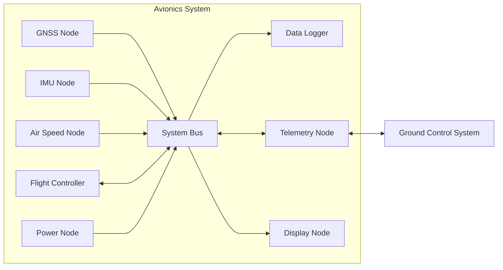

# Concept

この文書では、Swingbyの電装システムにおける通信インターフェースの設計思想と、その設計上の判断について説明します。

現在の通信インターフェースの構成については [Architecture](architecture.md) を、通信仕様を変更・追加する際の手順やルールについては [Development](development.md) を参照してください。本ドキュメントでは、これらの構成やルールを採用した理由を説明します。

また、本ドキュメントで使用する用語については [Terms](terms.md) に定義しています。

## Background

Swingbyの電装の通信システムは、複数のノードがSystem Busを介して接続された構成になっています。各ノードは、GNSS、慣性計測、対気速度計測、機体制御、電源管理、データ記録、テレメトリまたは表示など、それぞれ異なる役割を持っています。

以下に、Swingbyの電装の通信システムのノード間の接続関係を示します。




図中の矢印は、メッセージの送信方向を示します。双方向の矢印は、メッセージが双方向に送信されることを示します。

これらのノードは、運用中に互いにデータを交換する必要があります。さらに、電装システム内で交換されるデータの一部は、地上管制システムなどの外部システムに送信または受信される必要があります。

ノードの数と交換されるデータの種類が増えるにつれて、各ファームウェアごとに通信インターフェースを独立して定義することは維持が困難になります。そのため、ノード間のインターフェースを一貫性のあるものに保つために、共通のデータ表現と通信プロトコルが必要になります。

## Communication Requirements

通信システムは以下の要件を満たす必要があります。

1. ノード間で交換されるデータは、共通かつ明確な定義を持つ必要がある
1. ノード間で交換されるデータの各fieldの意味、型および表現は、特定のファームウェアの実装に依存してはならない
1. 同じmessage definitionは、複数のファームウェア実装で使用可能である必要がある。システムは異なるマイコン、プログラミング言語および開発環境を使用する可能性があり、通信インターフェースは各実装が独自のデータ表現を定義することを要求してはならない
1. 通信データは、定義されたwire formatを持つ必要がある。フォーマットは、組み込み通信バスで使用するのに十分にコンパクトである必要があり、異なる実装間で同じ論理messageを交換できる必要がある
1. 通信インターフェースは、code generationに適している必要がある。共通のmessage definitionは、実装固有のlibraryを生成するために使用される必要があり、serializationおよびdeserializationは各ファームウェアで独自に実装する必要がない
1. 通信プロトコルは、オンボードのノード間だけでなく、地上管制システムやデータロガーなどの外部システムでも使用可能である必要がある

## Design Principles

Swingbyの通信システムでは、通信仕様を特定のファームウェアやアプリケーションの実装から独立して管理できることを重視します。そのため、以下の原則に基づいて通信インターフェースを設計します。

1. Message DefinitionをSingle Source of Truthとする
1. 通信仕様を実装から独立させる
1. Code Generationを利用する
1. Message DefinitionとTransportを分離する
1. 必要な仕様を選択的に採用する
1. 責務に基づいて通信仕様を構成する
1. 通信仕様の変更を追跡可能にする

### Message DefinitionをSingle Source of Truthとする

通信で交換されるMessageの構造、fieldの型、単位および意味は、単一のMessage Definitionによって定義します。

各firmwareやapplicationが通信仕様を個別に定義することは避け、共通のDefinitionから各実装に必要なlibraryを生成します。これにより、異なる実装間で通信仕様が意図せず分岐することを防ぎます。

### 通信仕様を実装から独立させる

Message Definitionは、特定のprogramming language、microcontroller、firmware frameworkまたはapplication frameworkに依存しないものとします。

同じMessage Definitionを異なるNodeやsoftware implementationから利用できるようにすることで、実装技術の違いによって通信インターフェースを変更する必要がない構成を目指します。

### Code Generationを利用する

Messageのserializationおよびdeserializationは、各firmwareやapplicationが独自に実装するのではなく、共通のDefinitionから生成されたlibraryを利用します。

これにより、Message Definitionとwire formatの解釈を各実装で個別に維持する必要をなくし、実装間の互換性を保ちます。

### Message DefinitionとTransportを分離する

Messageが表現するデータの意味と、そのデータをどの通信媒体で転送するかは、可能な限り独立して扱います。

例えば、センサーの測定値を表すMessageは、CAN FD、UART、UDPなどの特定のTransportを前提として定義しません。一方で、Transport固有の制御やProtocolが必要な場合は、通常のApplication Messageとは分離して定義します。

### 必要な仕様を選択的に採用する

MAVLinkで提供されているすべてのMessage DefinitionやMicroserviceを採用するのではなく、Swingbyの通信システムに必要なものを選択して利用します。

一般的に使われているものを利用できる場合は可能な限り既存の定義を利用しますが、Swingby固有のデータや要件については独自の定義を追加します。

これにより、MAVLinkとの互換性を維持しながら、Swingbyのシステムに不要な仕様まで通信インターフェースに含めることを避けます。

### 責務に基づいて通信仕様を構成する

Message Definitionは、単に利用するNodeやfirmwareごとに分割するのではなく、Messageが持つ責務や意味に基づいて整理します。

例えば、センサーによる直接観測値、推定・計算された値、システム管理、Command、Diagnosticsなどは、それぞれ異なる責務として扱います。

この構成により、複数のNodeが同じ通信仕様を再利用できるようにするとともに、新しいNodeやProtocolを追加する際にも既存のDefinitionを適切に組み合わせられるようにします。

### 通信仕様の変更を追跡可能にする

Message Definition、生成されたlibraryおよびそれを利用するfirmwareやapplicationの関係をrepositoryと自動化されたvalidationによって管理します。

通信仕様の変更がどのDefinitionに由来するものなのかを明確にし、複数の実装間で仕様が不整合になることを防ぎます。


## Protocol Selection

共通の通信インターフェースを実装するために、いくつかのアプローチがあると思います。

1. 電装システム専用のプロトコルを定義する。このアプローチでは、message formatおよび通信動作を完全に制御できるが、独自のwire format、serializationおよびdeserializationの規則、code generation tool、および互換性の規則を定義し維持する必要がある。
1. 汎用のserializationまたはinterface-definition systemを使用する。このアプローチでは、標準化されたデータ表現およびcode generationを提供できるが、wire formatおよび通信モデルは、組み込み電装通信システムの要件に最適化されていない可能性がある。

既存のものの中でも、[MAVLink](https://mavlink.io)は以下の特徴があったため、このシステムの通信プロトコルとして選択しました。

- wire format、serializationおよびdeserializationの規則が決まっている
- code generation toolを提供している
- serialization/deserializationの処理やwire formatが十分軽量である

## How Swingby Uses MAVLink

MAVLinkは、message definitionの表現およびwire formatを定義だけでなく、標準のmessage definitionもあります。しかし、電装システムは、舵角計、風見計、対気速度計、慣性計測ユニットなどの独自のセンサーを使用するため、独自のmessage definitionが必要です。

このため、電装システムは、MAVLinkの標準のmessage definitionを使用するのではなく、独自のMAVLink dialectを定義しています。

独自のdialectを定義していることにより、MAVLinkで提供されているもの全ては利用することはできず、何を採用するか取捨選択する必要があります。

| 対象                            | 採用            | 方針                                           |
| ----------------------------- | :-----------: | -------------------------------------------- |
| MAVLink Wire Format           |○| MAVLink V2のWire Formatを通信フォーマットとして採用する          |
| MAVLink Definition Schema     |○| MAVLink XMLによるMessage定義を採用する                 |
| MAVLink Common Dialect        |×| `common.xml`を採用せず、Swingby固有のMessageを独自Dialectとして定義する  |
| MAVLink Code Generator        |○| 既存のMAVLink generatorを利用して各言語の実装を生成する         |
| Generated C/C++ Library       |△| Swingbyのdialectから生成された`mavlink-cpp`を利用する|
| Python MAVLink Library |×| `pymavlink`ではなく`mavlink-python`を利用する|
| MAVLink Microservices         |△| 必要なProtocolのみ採用する|
| MAVLink Router / Routing      |△| システム構成に応じて利用する|
| GCS / MAVLinkアプリケーション |×|独自に実装したものを使う|

## Deialect Design

### system.xml

`system.xml`は、MAVLink Systemを成立・管理するための基本機能を扱います。

対象となるのは、例えば以下です。

- `HEARTBEAT`
- `TIMESYNC`
- `PARAM_*`

それぞれの役割は異なりますが、

* Systemの存在・識別
* System間の時刻同期
* Systemの設定・管理

という観点から、System Managementという共通した責務を持ちます。

Parameter Protocolについては、SwingbyではSystemの基本的な管理機能として扱う。一方、`PARAM_EXT_*`は採用しません。

### command.xml

`command.xml`は、Systemに対して操作を要求するためのCommand Protocolを扱います。

主な対象は、

- COMMAND_LONG
- COMMAND_INT
- COMMAND_ACK
- MAV_CMD
- MAV_RESULT

である。

`MAV_CMD`だけを単独のdialectとして扱うのではなく、Command Protocolを構成するmessageおよびenumと合わせて管理します。

標準MAVLinkで定義されたcommandを採用する場合は、command IDなどの標準仕様を維持します。

Swingby固有のcommandが必要になった場合には、標準仕様との衝突を避けて追加します。

### sensor.xmlとmodel.xml

Swingbyでは、観測値と推定値を区別します。

#### sensor.xml

`sensor.xml`には、センサーによって直接観測された値を定義します。

例えば、

- Angular velocity
- Acceleration
- Differential pressure
- Magnetic field
- GPS measurements

などです。

#### model.xml

`model.xml`には、観測値や内部状態から推定・計算された値を定義します。

例えば、

- Attitude
- Velocity
- Airspeed
- Wind velocity
- Estimated position

などです。

概念的には、

```text
Physical World
      │
      ▼
   Sensor
      │
      ▼
 sensor.xml
      │
      │ estimation / fusion / calculation
      ▼
 model.xml
```

となります。

例えば、差圧センサーから直接得られる差圧は`sensor.xml`、差圧などから推定されたAirspeedは`model.xml`に分類します。


### diagnostics.xml

`diagnostics.xml`は、機器やSystemの健全性、状態、保守に関する情報を扱います。

例えば、

- Battery status
- Calibration status
- Sensor health
- Component health
- Error
- Warning
- Operational status

などです。

`diagnostics.xml`と`sensor.xml`の区別は、「何を観測したか」と「その機器が正常か」を基準とします。

例えば、

```text
Gyroscope angular velocity
    → sensor.xml

Gyroscope health
    → diagnostics.xml

Gyroscope calibration status
    → diagnostics.xml
```

とします。

### transport.xml

`transport.xml`は、MAVLink messageをTransport上で扱うために必要なProtocolを扱います。

Applicationが扱うデータと、Transport固有の情報を分離することを目的とします。

SwingbyではCAN FDを主要なTransportの一つとして扱います。

通常のMAVLink Application messageは、可能な限り一つのCAN FD frameに収めます。

一方、Transport層で必要となる場合には、Transport-specific messageによって分割・再構成などを行います。

Transport上の都合による情報を、Application messageに直接持ち込まないようにします。

### debug.xml

`debug.xml`は、開発・試験・検証を目的とするmessage definitionsを扱います。

例えば、

- Internal state
- Development telemetry
- Test data
- Debug information

などです。

`debug.xml`のmessageは、原則として製品間のProtocol compatibilityを保証する対象としないことにします。

正式なApplication Protocolとして定着した場合には、適切なdialectへの移動を検討します。

### Common dialectの採用方針

MAVLinkでは、標準的なmessage definitionsとして[common.xml](https://mavlink.io/en/messages/common.html)が定義されています。

Swingbyでは、標準定義を利用できる場合には可能な限り利用します。

ただし、標準定義を採用するかどうかは、以下を基準として判断します。

1. Swingbyで実際に必要か
2. 既存の標準定義で要求を満たせるか
3. 将来の互換性を維持する価値があるか
4. Swingby独自定義を追加する合理的な理由があるか

標準定義を採用する場合には、原則として既存のIDや値を変更しないことにします。

特にmessage ID、enum value、command IDなどは、既存の標準仕様との互換性を維持させます。

一方、使用しないstandard definitionを、将来使う可能性だけを理由として追加することはしません。

## Repository Structure

通信インターフェイスは、これらの扱う範囲に応じて複数のrepositoryに分割される。

`mavlink-dialect`は、電装システムで使用されるMAVLink message definitionのsource of truthである。

`mavlink-cpp`は、ファームウェアおよびその他のC++アプリケーションで使用される生成済みのC++ libraryを提供する。このlibraryは、`mavlink-dialect`で管理されるdefinitionから生成される。

Transport固有の実装は、message definitionとは別に管理される。例えば、CAN FD Transportは`mavlink-canfd`で提供されるようにします。

よって、望ましい依存関係は以下の通りになります。

```text
mavlink-dialect
       │
       │ code generation
       ▼
mavlink-cpp
       │
       │ dependency
       ▼
Firmware / Applications
```

この構成により、各ファームウェアが独自の通信仕様の定義を維持することを防ぐことができ、さらに、特定の実装に依存せず通信仕様を定義できます。