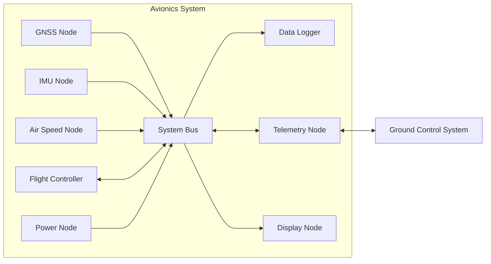

# Concept

## Background

Swingbyの電装の通信システムは、複数のノードがSystem Busを介して接続された構成になっています。各ノードは、GNSS、慣性計測、対気速度計測、機体制御、電源管理、データ記録、テレメトリまたは表示など、それぞれ異なる役割を持っています。

以下に、Swingbyの電装の通信システムのノード間の接続関係を示します。




図中の矢印は、メッセージの送信方向を示します。双方向の矢印は、メッセージが双方向に送信されることを示します。

これらのノードは、運用中に互いにデータを交換する必要があります。さらに、電装システム内で交換されるデータの一部は、地上管制システムなどの外部システムに送信または受信される必要があります。

ノードの数と交換されるデータの種類が増えるにつれて、各ファームウェアごとに通信インターフェースを独立して定義することは維持が困難になります。そのため、ノード間のインターフェースを一貫性のあるものに保つために、共通のデータ表現と通信プロトコルが必要になります。

## Communication Requirements

通信システムは以下の要件を満たす必要があります。

1. ノード間で交換されるデータは、共通かつ明確な定義を持つ必要がある
1. ノード間で交換されるデータの各fieldの意味、型および表現は、特定のファームウェアの実装に依存してはならない
1. 同じmessage definitionは、複数のファームウェア実装で使用可能である必要がある。システムは異なるマイコン、プログラミング言語および開発環境を使用する可能性があり、通信インターフェースは各実装が独自のデータ表現を定義することを要求してはならない
1. 通信データは、定義されたwire formatを持つ必要がある。フォーマットは、組み込み通信バスで使用するのに十分にコンパクトである必要があり、異なる実装間で同じ論理messageを交換できる必要がある
1. 通信インターフェースは、code generationに適している必要がある。共通のmessage definitionは、実装固有のlibraryを生成するために使用される必要があり、serializationおよびdeserializationは各ファームウェアで独自に実装する必要がない
1. 通信プロトコルは、オンボードのノード間だけでなく、地上管制システムやデータロガーなどの外部システムでも使用可能である必要がある

## Protocol Selection

共通の通信インターフェースを実装するために、いくつかのアプローチがあると思います。

1. 電装システム専用のプロトコルを定義する。このアプローチでは、message formatおよび通信動作を完全に制御できるが、独自のwire format、serializationおよびdeserializationの規則、code generation tool、および互換性の規則を定義し維持する必要がある。
1. 汎用のserializationまたはinterface-definition systemを使用する。このアプローチでは、標準化されたデータ表現およびcode generationを提供できるが、wire formatおよび通信モデルは、組み込み電装通信システムの要件に最適化されていない可能性がある。

既存のものの中でも、[MAVLink](https://mavlink.io)は以下の特徴があったため、このシステムの通信プロトコルとして選択しました。

- wire format、serializationおよびdeserializationの規則が決まっている
- code generation toolを提供している
- serialization/deserializationの処理やwire formatが十分軽量である

## Use of MAVLink

MAVLinkは、message definitionの表現およびwire formatを定義だけでなく、標準のmessage definitionもあります。しかし、電装システムは、舵角計、風見計、対気速度計、慣性計測ユニットなどの独自のセンサーを使用するため、独自のmessage definitionが必要です。

このため、電装システムは、MAVLinkの標準のmessage definitionを使用するのではなく、独自のMAVLink dialectを定義しています。

独自のdialectを定義していることにより、MAVLinkで提供されているもの全ては利用することはできず、何を採用するか取捨選択する必要があります。

| 対象                            | 採用            | 方針                                           |
| ----------------------------- | :-----------: | -------------------------------------------- |
| MAVLink Wire Format           |○| MAVLink V2のWire Formatを通信フォーマットとして採用する          |
| MAVLink Definition Schema     |○| MAVLink XMLによるMessage定義を採用する                 |
| MAVLink Common Dialect        |×| `common.xml`を採用せず、Swingby固有のMessageを独自Dialectとして定義する  |
| MAVLink Code Generator        |○| 既存のMAVLink generatorを利用して各言語の実装を生成する         |
| Generated C/C++ Library       |△| Swingbyのdialectから生成された`mavlink-cpp`を利用する|
| Python MAVLink Library |×| `pymavlink`ではなく`mavlink-python`を利用する|
| MAVLink Microservices         |△| 必要なProtocolのみ採用する|
| MAVLink Router / Routing      |△| システム構成に応じて利用する|
| GCS / MAVLinkアプリケーション |×|独自に実装したものを使う|


## Repository Structure

通信インターフェイスは、これらの扱う範囲に応じて複数のrepositoryに分割される。

`mavlink-dialect`は、電装システムで使用されるMAVLink message definitionのsource of truthである。

`mavlink-cpp`は、ファームウェアおよびその他のC++アプリケーションで使用される生成済みのC++ libraryを提供する。このlibraryは、`mavlink-dialect`で管理されるdefinitionから生成される。

Transport固有の実装は、message definitionとは別に管理される。例えば、CAN FD Transportは`mavlink-canfd`で提供されるようにします。

よって、望ましい依存関係は以下の通りになります。

```text
mavlink-dialect
       │
       │ code generation
       ▼
mavlink-cpp
       │
       │ dependency
       ▼
Firmware / Applications
```

この構成により、各ファームウェアが独自の通信仕様の定義を維持することを防ぐことができ、さらに、特定の実装に依存せず通信仕様を定義できます。

## Design Goals

この通信システムの設計では、以下を達成することを目標にしました。

1. message definitionを単一のsource of truthとして維持する
1. 同じmessage definitionを、異なるNodeおよびソフトウェア実装で使用可能にする
1. MAVLink固有のprotocol processingが、各ファームウェアが独自に実装するのではなく、共有の生成済みlibraryによって提供される
1. Transport固有の動作が、個々のmessageの意味論とは独立して維持される
1. message definition、生成済みlibraryおよびファームウェアの依存関係の変更が、repositoryおよび自動化されたvalidationを通じて追跡可能である

## Definition of Term

本章では、本仕様で使用する主要な用語について説明します。

**MAVLink** は、システム間で構造化されたデータを交換するための軽量なメッセージングプロトコルです。本システムでは、電装システム間および電装システムと地上システムとの間でデータを交換するためにMAVLinkを使用します。

**MAVLink dialect** は、MAVLinkで交換するメッセージ、列挙型、コマンドなどのデータ定義をまとめたものです。本repositoryでは、本システムで使用するMAVLink dialectを定義します。

**MAVLink message** は、MAVLink dialectによって定義される論理的なデータ単位です。MAVLink messageは、複数のfieldから構成され、各fieldはデータ型、意味および単位を持ちます。

**Field** は、MAVLink messageを構成する個々のデータ要素です。Fieldには、名前、データ型および意味が定義されます。必要に応じて、単位、スケールなども定義されます。

**Wire format** は、通信媒体上でデータを交換するために使用するバイト列の構造および符号化規則です。Wire formatは、論理的なデータの表現方法と、通信上で実際に扱われるバイト列との対応を規定します。本システムでは、MAVLink 2がMAVLink messageをMAVLink packetとして表現するwire formatを規定します。

**MAVLink packet** は、MAVLinkのwire formatに従ってMAVLink messageを符号化したバイト列です。MAVLink packetには、messageの識別情報、payloadおよび整合性を確認するための情報などが含まれます。

**Transport** は、MAVLink packetをある通信ノードから別の通信ノードへ転送するための仕組みです。本システムでは、CAN FDなどの通信方式をMAVLink packetのtransportとして使用します。

**Transport frame** は、transportが通信媒体上で転送するデータ単位です。例えばCAN FDをtransportとして使用する場合、CAN FD frameがtransport frameに相当します。MAVLink packetとtransport frameは異なる概念であり、1つのMAVLink packetを複数のtransport frameに分割して転送する場合があります。

**Node** は、MAVLink messageを送信または受信するシステム上の通信主体です。Nodeには、例えばGNSS基板、IMU基板、フライトコンピュータ、データロガーおよびGround Control Systemが含まれます。